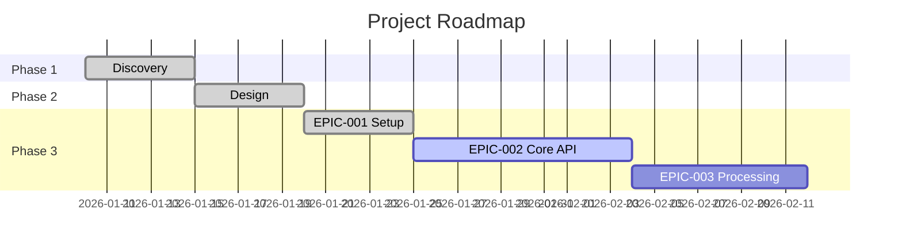

# /roadmap - Timeline e Dependencias do Projeto

## Objetivo
Visualizar o roadmap completo do projeto com fases, epics, milestones e dependencias.

---

## Instrucoes para a IA

### 1. Coletar Dados

Ler em paralelo:
- `CLAUDE.md` (projeto)
- `.ai-context.md` (arquitetura)
- `doc/task/context-session.md` (status)
- `doc/project/manifest.json` (se existir)
- `PRPs/*.md` (todos os PRPs)
- `PRPs/*-todo.md` (progresso)

### 2. Mapear Fases

```
Fase 1: Discovery & Planning
Fase 2: Technical Design
Fase 3: Development
Fase 4: Testing & QA
Fase 5: Deploy & Infrastructure
Fase 6: Launch & Operations
```

### 3. Gerar Visualizacao

---

## Formato de Saida

### Roadmap Visual (ASCII)

```
================================================================================
                         [PROJETO] - ROADMAP
================================================================================

Timeline: [periodo]
Status: [fase atual] ([progresso]%)

--------------------------------------------------------------------------------
                                    FASES
--------------------------------------------------------------------------------

[##########] Phase 1: Discovery        DONE     |████████████████████| 100%
[##########] Phase 2: Design           DONE     |████████████████████| 100%
[#####-----] Phase 3: Development      ACTIVE   |██████████----------| 50%
[----------] Phase 4: Testing          PENDING  |--------------------| 0%
[----------] Phase 5: Deploy           PENDING  |--------------------| 0%
[----------] Phase 6: Launch           PENDING  |--------------------| 0%

--------------------------------------------------------------------------------
                              EPICS (Phase 3)
--------------------------------------------------------------------------------

Epic                          Status        Progress    Dependencies
----------------------------------------------------------------------------
[EPIC-001] Setup              DONE          |████████| 100%    -
[EPIC-002] Core API           IN PROGRESS   |████----| 50%     EPIC-001
[EPIC-003] Processing         PENDING       |--------| 0%      EPIC-002
[EPIC-004] Storage            PENDING       |--------| 0%      EPIC-001
[EPIC-005] Search             PENDING       |--------| 0%      EPIC-003, EPIC-004

--------------------------------------------------------------------------------
                            CURRENT SPRINT
--------------------------------------------------------------------------------

Sprint [N] ([datas])
Goal: [objetivo]

Stories:
  [STORY-001] ...       IN PROGRESS   |████----| 50%
  [STORY-002] ...       TODO          |--------| 0%

Blockers:
  ! [blocker se houver]

--------------------------------------------------------------------------------
                             MILESTONES
--------------------------------------------------------------------------------

[x] M1: [nome]                    [data]    DONE
[x] M2: [nome]                    [data]    DONE
[ ] M3: [nome]                    [data]    IN PROGRESS
[ ] M4: [nome]                    [data]    PENDING
[ ] M5: [nome]                    [data]    PENDING

--------------------------------------------------------------------------------
                            DEPENDENCIES
--------------------------------------------------------------------------------

EPIC-001 ──► EPIC-002 ──► EPIC-003 ──┐
    │                                │
    └──► EPIC-004 ───────────────────┴──► EPIC-005

--------------------------------------------------------------------------------
                              RISKS
--------------------------------------------------------------------------------

[HIGH]   [Descricao do risco]
[MEDIUM] [Descricao do risco]
[LOW]    [Descricao do risco]

================================================================================
                         Generated: [timestamp]
================================================================================
```

---

## Variacoes

### /roadmap --current
Apenas sprint/fase atual:
```
--------------------------------------------------------------------------------
                            CURRENT SPRINT
--------------------------------------------------------------------------------
Sprint 2 (Jan 20 - Feb 03)
Goal: Complete Core API

  [████----] 50% complete

  In Progress:
    > STORY-004: Upload endpoint (50%)
    > STORY-005: Processing queue (25%)

  Remaining:
    - STORY-006: Status endpoint
    - STORY-007: Error handling

  Blockers: 1
    ! Rate limiting definition needed
--------------------------------------------------------------------------------
```

### /roadmap --epics
Focar nos epics:
```
EPICS OVERVIEW

[DONE]        EPIC-001: Setup & Config
[IN PROGRESS] EPIC-002: Core API Development
[BLOCKED]     EPIC-003: Processing Pipeline
[PENDING]     EPIC-004: Storage System
[PENDING]     EPIC-005: Search & Retrieval

Dependencies:
  001 → 002 → 003 → 005
  001 → 004 → 005
```

### /roadmap --mermaid
Para documentacao (gera Mermaid):


### /roadmap --json
Para integracoes:
```json
{
  "project": "Nome",
  "phases": [...],
  "epics": [...],
  "milestones": [...],
  "current_sprint": {...}
}
```

---

## Reprojecao de Timeline

Se solicitado com `--reproject`:

```
--------------------------------------------------------------------------------
                         TIMELINE PROJECTION
--------------------------------------------------------------------------------

Based on current velocity: 15 pts/sprint

Original vs Projected:

| Milestone        | Original | Projected | Delta    |
|------------------|----------|-----------|----------|
| MVP Ready        | Feb 10   | Feb 17    | +7 days  |
| Tests Complete   | Feb 20   | Mar 01    | +9 days  |
| Production       | Mar 01   | Mar 15    | +14 days |

Recommendations:
1. Add resource to EPIC-003 (critical path)
2. Reduce scope of EPIC-005 for MVP
3. Parallelize EPIC-004 with EPIC-002
--------------------------------------------------------------------------------
```

---

## Interacao Pos-Roadmap

```
Acoes disponiveis:

[1] Detalhar Epic - Ver stories de um epic
[2] Ver Sprint - Focar no sprint atual
[3] Exportar - Gerar arquivo
[4] Reprojetar - Recalcular timeline
[5] Riscos - Analisar riscos

Digite numero ou 'q' para sair:
```

---

## Exemplo de Uso

```bash
/roadmap              # Roadmap completo
/roadmap --current    # Apenas sprint atual
/roadmap --epics      # Focar em epics
/roadmap --mermaid    # Gerar diagrama
/roadmap --reproject  # Reprojetar timeline
```

---

**Context Engineering 2.1** - Visibilidade completa do progresso.
